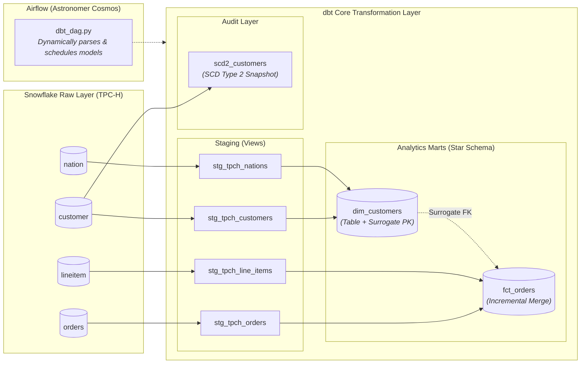

# 🚀 Enterprise Data Platform Reference Architecture: dbt, Snowflake & Airflow (Cosmos)

[](https://www.getdbt.com/)
[](https://www.snowflake.com/)
[](https://airflow.apache.org/)
[](https://astronomer.github.io/astronomer-cosmos/)
[](https://www.docker.com/)

---

## 📌 Executive Summary

This repository delivers an end-to-end **Enterprise Reference Architecture** demonstrating how to design, deploy, and operate a scalable, cost-optimized ELT data pipeline across the **Modern Data Stack (MDS)**.

The project demonstrates:
1. **Incremental Processing & Late-Arriving Delta Handling**: High-performance incremental modeling on [`fct_orders`](dags/dbt_analytics/models/marts/fct_orders.sql) using `materialized='incremental'` with Snowflake's `merge` strategy and a dynamic 3-day lookback window (`is_incremental()`). This eliminates expensive full-table scans, slashes Snowflake warehouse credits, and idempotently reconciles late-arriving and updated records.
2. **Modular Dimensional Modeling with dbt Core**: Transforming raw transactional data (Snowflake TPC-H benchmark) into a Kimball star schema with conformed dimension entities ([`dim_customers`](dags/dbt_analytics/models/marts/dim_customers.sql)), cryptographic surrogate primary keys (`dbt_utils.generate_surrogate_key`), and intermediate aggregation layers.
3. **Cloud Data Warehousing & FinOps on Snowflake**: Optimizing warehouse compute through strategic multi-tier materialization—ephemeral views for staging, physical tables for read-heavy dimensions, and incremental merges for high-volume facts.
4. **Workflow Orchestration with Apache Airflow & Astronomer Cosmos**: Translating dbt models dynamically into native Airflow task graphs with granular task-level visibility, retries, failure isolation, and containerized runtime execution (`dbt_venv`).
5. **Change Data Capture & Enterprise Governance**: Implementing SCD Type 2 snapshots ([`scd2_customers`](dags/dbt_analytics/snapshots/scd2_customers.sql)) for point-in-time customer auditability, automated source freshness SLA monitoring, and multi-tier data quality tests (schema constraints + singular business invariants).

> [!IMPORTANT]
> **Incremental Update Highlight**:
> Instead of costly full-table rebuilds (`dbt run --full-refresh`), the sales order fact table uses:
> - **Strategy**: `incremental_strategy='merge'` on `unique_key='order_key'` for atomic upserts.
> - **Lookback Buffer**: `order_date >= (select dateadd(day, -3, max(order_date)) from {{ this }})` to capture late-arriving and amended transactions without scanning historical partitions.

---

## 🏗️ Architecture & Data Lineage



---

## 📊 Dimensional Models & Strategy Matrix

| Layer | Model | Materialization | Grain & Purpose |
| :--- | :--- | :--- | :--- |
| **Staging** | `stg_tpch_orders`<br/>`stg_tpch_line_items`<br/>`stg_tpch_customers`<br/>`stg_tpch_nations` | `view` | Cleans column naming conventions, standardizes datatypes, and creates zero-storage transformation views over raw Snowflake sources. |
| **Dimension** | `dim_customers` | `table` | **1 row per customer**. Conformed dimension generating cryptographic surrogate keys (`customer_pk`) and enriching customer profiles with nation lookups. |
| **Fact** | `fct_orders` | `incremental`<br/>*(strategy: merge)* | **1 row per sales order**. Incrementally merges new and updated orders using a **3-day lookback buffer** to handle late-arriving records without full table scans. |
| **Snapshot** | `scd2_customers` | `snapshot`<br/>*(strategy: check)* | **SCD Type 2 Change Data Capture**. Tracks historical point-in-time changes to customer address, phone, balance, and market segment. |

---

## 💡 Key Architectural Decisions (Interview Talking Points)

### 1. Why Astronomer Cosmos instead of a traditional `BashOperator`?
* **Granular Failure Blast Radius**: If 1 model fails out of 50, only that model and its downstream dependents fail. Upstream and parallel models complete successfully, and only failed tasks need retrying.
* **Native Airflow UI Lineage**: Each dbt model and schema test is rendered as an independent Airflow task with dedicated logs.
* **Independent Scalability**: Tasks leverage Airflow's distributed scheduler and executor capacity rather than bottlenecking on a single worker's thread pool.

### 2. Why dual virtual environments (`dbt_venv`) in Docker?
* **Eliminating Dependency Collisions**: Airflow providers and `dbt-snowflake` frequently have conflicting sub-dependencies (e.g., `cryptography`, `urllib3`, `pyOpenSSL`).
* **Clean Decoupling**: The Astro Dockerfile builds an isolated virtualenv (`/usr/local/airflow/dbt_venv`) specifically for `dbt-snowflake`. Airflow runs in the main runtime and invokes dbt via its isolated binary.

### 3. How does FinOps / Cost Optimization work in Snowflake?
* **Views for Staging**: Zero compute/storage overhead for initial column cleaning and source abstraction.
* **Incremental Merge for Facts**: Large fact tables (`fct_orders`) use `incremental_strategy='merge'` with partition pruning and a 3-day lookback window (`order_date >= (select dateadd(day, -3, max(order_date)) from {{ this }})`). This guarantees idempotent updates without expensive full-table recomputations.
* **Tables for Marts**: Read-heavy dimensions (`dim_customers`) are materialized as physical tables for fast BI dashboard queries.

### 4. How is Data Quality enforced?
* **Source Freshness SLAs**: Monitors ingestion latency on source tables (`warn_after: 24h`, `error_after: 72h`) before running downstream models.
* **Schema Constraints**: Enforces `unique`, `not_null`, and referential integrity (`relationships`) across primary and foreign surrogate keys.
* **Singular SQL Assertions**: Custom SQL tests validate core business rules (e.g., ensuring discounts are never positive numbers and order dates fall within valid historical boundaries).

---

## 📂 Repository Structure

```text
├── Dockerfile                      # Astro Runtime with isolated dbt_venv
├── requirements.txt                # Airflow providers: astronomer-cosmos & snowflake
├── airflow_settings.yaml           # Local connection credentials template
├── dags/
│   ├── dbt_dag.py                  # Cosmos DbtDag definition orchestrating Snowflake
│   ├── .airflowignore              # Excludes dbt internal folders from Airflow parser
│   └── dbt_analytics/              # Production dbt Core project
│       ├── dbt_project.yml         # Project configs & materialization rules
│       ├── packages.yml            # dbt package management (dbt-labs/dbt_utils)
│       ├── macros/pricing.sql      # Custom Jinja discount calculation macro
│       ├── snapshots/scd2_customers.sql # SCD Type 2 customer snapshot
│       ├── models/
│       │   ├── staging/            # Staging views & source definitions (tpch_sf1)
│       │   └── marts/              # Conformed dim_customers & incremental fct_orders
│       └── tests/                  # Custom business logic SQL assertion tests
└── tests/dags/test_dag_example.py  # Pytest suite for DAG import and syntax integrity
```

---

## 🛠️ Quickstart: Run Locally in 3 Steps

### Prerequisites
- [Docker Desktop](https://www.docker.com/products/docker-desktop/)
- [Astronomer CLI (astro)](https://www.astronomer.io/docs/astro/cli/install-cli)

### 1. Clone the Repository
```bash
git clone https://github.com/vinayvp/dbt_airflow_demo.git
cd dbt_airflow_demo
```

### 2. Configure Snowflake Connection
Update `airflow_settings.yaml` (or add via Airflow UI: **Admin ➔ Connections ➔ `snowflake_conn`**):
```yaml
airflow:
  connections:
    - conn_id: snowflake_conn
      conn_type: snowflake
      conn_login: <YOUR_SNOWFLAKE_USER>
      conn_password: <YOUR_SNOWFLAKE_PASSWORD>
      conn_schema: dbt_schema
      conn_extra: {
        "account": "<YOUR_ACCOUNT_IDENTIFIER>",
        "warehouse": "dbt_wh",
        "database": "dbt_db",
        "role": "transform_role"
      }
```

### 3. Start the Airflow Stack
```bash
astro dev start
```
Navigate to **`http://localhost:8080`** (`admin` / `admin`) to trigger and monitor your pipeline.

### Run Automated Tests
```bash
astro dev pytest
```
