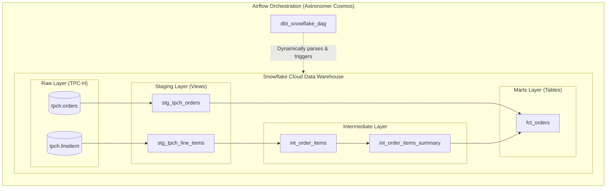

# 🚀 End-to-End Data Transformation & Orchestration: dbt, Snowflake & Airflow (Cosmos)

[](https://www.getdbt.com/)
[](https://www.snowflake.com/)
[](https://airflow.apache.org/)
[](https://astronomer.github.io/astronomer-cosmos/)
[](https://www.docker.com/)

---

## 📌 Executive Summary

This repository documents my practical journey in mastering the **Modern Data Stack (MDS)** by designing and deploying an end-to-end ELT data pipeline.

The project demonstrates:
1. **Data Transformation & Modeling with dbt**: Transforming raw transactional data into clean, tested, and analytics-ready dimensional models.
2. **Cloud Data Warehousing with Snowflake**: Leveraging Snowflake for scalable compute, schema management, and cost-optimized materializations (views vs. tables).
3. **Workflow Orchestration with Apache Airflow & Astronomer Cosmos**: Translating dbt models dynamically into native Airflow task graphs with granular task-level visibility, retries, and isolated environment execution.

---

## 🏗️ Architecture & Data Lineage



---

## 📖 The Learning Journey: How I Built & Understood Each Layer

### 1. Data Ingestion & Sources (Snowflake TPC-H)
- **Source Configuration**: Defined source models referencing Snowflake's sample `tpch_sf1` dataset via [`tpch_sources.yml`](dags/dbt_learn/models/staging/tpch_sources.yml).
- **Early Quality Checks**: Implemented source-level assertions (e.g., `unique` and `not_null` on order keys, and `relationships` validating foreign key integrity from `lineitem` to `orders`).

### 2. Modular dbt Modeling Architecture
I implemented the standard multi-layer dbt modeling methodology:

* **Staging Layer (`models/staging/`)**:
  - Acts as the single source of truth for downstream models.
  - Cleans, renames, and standardizes column names (e.g., converting cryptic TPC-H prefix columns like `o_orderkey` to `order_key`).
  - **Materialization**: Configured as `view` in Snowflake to minimize storage costs and always reflect live source data.

* **Intermediate Layer (`models/marts/`)**:
  - Handles business logic aggregations and joins before loading into user-facing marts.
  - Models:
    - [`int_order_items.sql`](dags/dbt_learn/models/marts/int_order_items.sql): Applies discounts and line item pricing calculations.
    - [`int_order_items_summary.sql`](dags/dbt_learn/models/marts/int_order_items_summary.sql): Aggregates total gross sales and discount totals per order.

* **Marts Layer (`models/marts/`)**:
  - [`fct_orders.sql`](dags/dbt_learn/models/marts/fct_orders.sql): A curated fact table joining orders with aggregated item summaries, designed for high-performance BI reporting.
  - **Materialization**: Configured as `table` in Snowflake using a dedicated virtual warehouse (`dbt_wh`) for optimal query performance.

### 3. Reusable Logic & Packages (Jinja & Macros)
* **DRY Code with Macros**: Built [`pricing.sql`](dags/dbt_learn/macros/pricing.sql) containing the `discounted_amount` macro to encapsulate recurring price and discount calculation logic across multiple models.
* **Ecosystem Packages**: Integrated `dbt-labs/dbt_utils` through `packages.yml` to utilize battle-tested community macros and tests.

### 4. Data Quality & Testing Strategy
Reliability is enforced through a two-tiered testing approach:
* **Generic Schema Tests ([`generic_tests.yml`](dags/dbt_learn/models/marts/generic_tests.yml))**:
  - `unique` and `not_null` constraints on primary keys.
  - `accepted_values` ensuring `status_code` only contains allowed domain values (`['P', 'O', 'F']`).
  - Referential integrity validation via `relationships` to ensure consistency between marts and staging.
* **Singular Custom SQL Tests ([`tests/`](dags/dbt_learn/tests/))**:
  - [`fct_orders_discount.sql`](dags/dbt_learn/tests/fct_orders_discount.sql): Validates that item discount amounts are never recorded as positive numbers (returns rows violating business invariants).
  - [`fct_orders_date_valid.sql`](dags/dbt_learn/tests/fct_orders_date_valid.sql): Enforces date boundary sanity checks (no future dates and no dates prior to 1990).

---

## ⚡ Airflow Orchestration with Astronomer Cosmos

### Why Astronomer Cosmos instead of a basic `BashOperator`?

| Consideration | Naive Approach (`BashOperator("dbt run")`) | Astronomer Cosmos (`DbtDag`) |
| :--- | :--- | :--- |
| **Visibility** | Entire dbt run is 1 monolithic black box task | Each model and test is its own discrete Airflow task |
| **Failures & Retries** | If 1 model fails, entire project must be rerun | Only failed models and downstream dependencies are retried |
| **Lineage** | No visibility in Airflow UI | Native DAG graph rendering model dependencies |
| **Execution** | Shared environment risks dependency collisions | Virtual environment isolation (`dbt_venv`) |

### Key Airflow Implementation Highlights
* **Dynamic Graph Construction**: In [`dags/dbt_dag.py`](dags/dbt_dag.py), Cosmos dynamically parses `dbt_project.yml` and converts models into native Airflow tasks.
* **Security & Profile Mapping**: Uses `SnowflakeUserPasswordProfileMapping` bound to Airflow Connection ID `snowflake_conn`, removing the need for plaintext credentials in `profiles.yml`.
* **Runtime Isolation**: Dockerized environment creates an isolated virtual environment (`/usr/local/airflow/dbt_venv`) containing `dbt-snowflake`, preventing package conflicts with Airflow's Python dependencies.
* **DAG Processor Optimization**: Configured [`dags/.airflowignore`](dags/.airflowignore) to prevent Airflow's DAG processor from redundantly scanning internal dbt folders.

---

## 📂 Repository Structure

```text
├── Dockerfile                  # Builds Astro Runtime with isolated dbt_venv
├── requirements.txt            # Airflow providers: astronomer-cosmos & snowflake
├── airflow_settings.yaml       # Local development credentials & connection template
├── dags/
│   ├── dbt_dag.py              # Cosmos DbtDag definition orchestrating Snowflake models
│   ├── .airflowignore          # Optimizes parser by ignoring dbt internal directories
│   └── dbt_learn/              # Complete dbt Core project
│       ├── dbt_project.yml     # dbt project config & model materialization rules
│       ├── packages.yml        # Package management (dbt-labs/dbt_utils)
│       ├── macros/
│       │   └── pricing.sql     # Custom Jinja macro: discounted_amount
│       ├── models/
│       │   ├── staging/        # Staging models & source definitions (TPC-H)
│       │   └── marts/          # Intermediate tables & fct_orders
│       └── tests/              # Singular custom business logic tests
└── tests/                      # Pytest DAG integrity and import validation
```

---

## 🛠️ How to Run Locally

### Prerequisites
- [Docker Desktop](https://www.docker.com/products/docker-desktop/)
- [Astronomer CLI (astro)](https://www.astronomer.io/docs/astro/cli/install-cli)

### 1. Clone the Repository
```bash
git clone https://github.com/vinayvp/dbt_dag_practise.git
cd dbt_dag_practise
```

### 2. Set Up Airflow Connection
In `airflow_settings.yaml` (or via Airflow UI -> **Admin -> Connections**), create connection `snowflake_conn`:
- **Connection Type**: `Snowflake`
- **Login / Password**: Your Snowflake credentials
- **Account**: `<account_identifier>`
- **Database / Schema**: `dbt_db` / `dbt_schema`
- **Warehouse**: `dbt_wh`

### 3. Start the Local Airflow Stack
```bash
astro dev start
```
Navigate to `http://localhost:8080` (credentials: `admin` / `admin`). Trigger the `dbt_dag` to watch your dbt models execute across Snowflake.

---

## 🧠 Key Takeaways & Competencies

- **Modern ELT Paradigms**: Loading raw data first and using in-warehouse transformation for speed and cost efficiency.
- **Data Engineering Best Practices**: Separation of concerns (staging vs. intermediate vs. marts), DRY principles via macros, and automated testing before deployment.
- **Enterprise-Grade Orchestration**: Production-ready pipeline orchestration avoiding monolithic scripts and utilizing containerized virtual environments with granular task-level monitoring.
